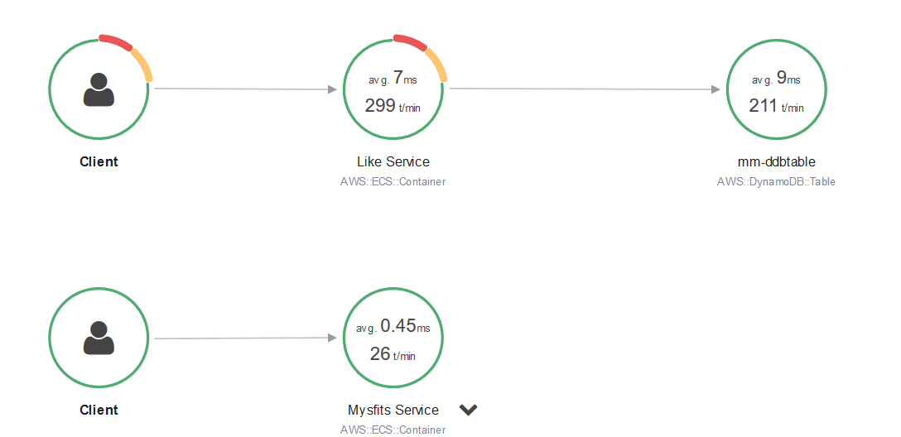

# Mythical Mysfits: A Micro-services application for Operational Excellence Exploration


## Workshop progress
✅ [Lab 0: Workshop Initialization](../lab-0-init)

**Lab 1: Instrument Observability - Distributed Tracing with AWS X-Ray**


- [Test AWS X-Ray](#4-test-your-configuration)
- [Reduce the signal from the noise](#5-reduce-the-signal-from-the-noise)

[Lab 2: Operationalize Observability - Aggregate Metrics](../lab-2-agg)

## LAB 1 - Instrument Observability - Distributed Tracing with AWS X-Ray

Observability helps quantify how we are able to meet our availability requirements. An important aspect of observability especially in a microservices architecture is distributed tracing. This enables the ability to profile a request as it passes through our application architecture which may involve one or more services and potentially interactions with backend data stores. Data captured from traces helps teams understand how the application behaves under various conditions and can be incredibly helpful when issues arise. For example, developers can use the data to identify inefficiencies in code and prioritize their sprints. Operations or SRE (site reliability engineering) teams can use the data to diagnose or triage unusual latencies or failures. Infrastructure engineers can use the data to make adjustments to resident scaling policies or resources supporting particular services.

AWS X-Ray is a distributed tracing service that provides a SDK to instrument your applications, a daemon to aggregate and deliver trace data to the X-Ray service, and a dashboard to view a service map which is a visualization of the trace data. If you would like to read more in depth about X-Ray, check out these links to documentation - [What is X-Ray?](https://docs.aws.amazon.com/xray/latest/devguide/aws-xray.html) and [X-Ray Concepts](https://docs.aws.amazon.com/xray/latest/devguide/xray-concepts.html)

In this lab, you'll continue where our lead developer left off before she was pulled to work on personalization for the application. No surprises there since the PM just got back from re:Invent, and there were many AI/ML sessions in his schedule.




The Mythical Mysfits application is made up of (2) microservices:

1. The **Mysfits service** (also referred to as the **_Core service_**) serves the Angular front-end application and hosts an API that returns Mysfit profiles from DynamoDB.
2. The **Like service** tracks the number of likes for a particular mysfit. When a visitor clicks on the heart icon next to a mysfit in the app, a counter for that mysfit's profile is incremented in DynamoDB.

Because of time constraints, we have pre-baked the micro-services instrumentation for X-Ray.  Should you like to learn more about this process, please look at the source code in  __~/environment/aws-multi-region-bc-dr-workshop/app/like-service/service/mysfits_like.py__ .  Alternatively, visit the full workshop on [github](https://github.com/aws-samples/aws-multi-region-bc-dr-workshop).

### Instructions

### [1] Test AWS X-Ray

Now that you've instrumented the like service, you should see additional trace data being reported to the service map in the X-Ray console whenever users use the like functionality in the application. This will include inbound http requests to the X-Ray service as well as downstream calls to DynamoDB when it increments the like counters for each mysfit liked.

#### a. Confirm you have a complete service map for the Mythical Mysfits application

1. Make sure you know the DNS endpoint for the service.  You can find this as follows:

    ```
     cat ~/environment/aws-multi-region-bc-dr-workshop/cfn-output.json | grep LoadBalancerDNS
    ```
    Note: You can also visit the CloudFormation dashboard, click on the workshop stack and find LoadBalancerDNS in the outputs tab.

2. Open a new tab and enter the load balancer DNS name to load the Mythical Mysfits application.  When the page loads, you should see a grid of mysfits and notice a heart icon in the bottom right corner of each box. Click on a few hearts for a few mysfits to generate some traffic to the Like service. The service was launched with chaos mode 'on' which randomly returns 404s and 500s, so you'd see more interesting data in the X-Ray service map. Keep clicking on the hearts until it lights up orange for a few mysfits.

    

3. Once you've liked a few mysfits, open a new browser tab and navigate to the [AWS X-Ray dashboard service map view](http://console.aws.amazon.com/xray/home#/service-map?timeRange=PT30M). You should see a service map representative of the Mythical Mysfits application, something like this -

    

    Note: It may take a minute for trace data to populate the service map. If you do not see a service map right away, keep generating requests in the app and refreshing the service map. If you do not see a service map appear after 5+ min, go back and review your Like service code to make sure it looks correct. Section 2-e has a hint with fully instrumented code for reference.

4. Generate some workload on the service.  There is a workload generator in ~/environments/ryder.  Run ryder to stream GETS and PUTS to the core and like services.  The script will automatically stop after generating 2500 POST requests, so re-run as needed. `Ctrl-C` will kill the process, if desired.

```
  ~/environment/aws-multi-region-bc-dr-workshop/ryder
```

The script will generate output, similar to the following:

```
(master) $ ~/environment/aws-multi-region-bc-dr-workshop/ryder
Request 0 (PUT) returned: <Response [200]>
Request 0 (GET) returned: <Response [200]>
Request 1 (PUT) returned: <Response [500]>
Request 2 (PUT) returned: <Response [200]>
Request 3 (PUT) returned: <Response [200]>
Request 4 (PUT) returned: <Response [200]>
```


5. Take some time to explore the service map a bit more. See what information you can glean by clicking on each service. Also, explore the raw trace data by clicking on **Trace** in the left menu.

    <details>
    <summary>Troubleshooting: Where did my service map go?</summary>

    The X-Ray dashboard has a time range drop-down menu in the upper right hand corner. This can be a custom time period or a relative time period, e.g. Last 5 minutes. If your service map goes blank while you're exploring, you may have exceeded the specified time range. Use the drop-down menu to extend the time window if needed, i.e. try changing it to last 30 min so it displays older trace data. Or generate more traffic to the application which will populate the service map with fresh data.
    </details>

You probably noticed that the **like** service has a problem.  About 25% of the time, it is returning 500 and 404 errors.


You may have also discovered that the response time graph is _lumpy_.  A significant amount of traces return in < 1 mSec, while the p98 is close to 10 mSec.  What could account for this behavior?
<details>
<summary>Hint</summary>

There are a mix of PUTs and GETs.  The PUTs do significantly more work, including updating a database.  The GETs are probably being served from cache. It is also possible that our errors return more quickly.  We could use filters to determine which of these theories is correct.

Here is the same data, filtered for errors ...


We will next explore filters.

</details>

### [2] Reduce the signal from the noise

One thing you'll notice is an abundance of GET requests to the Like service which doesn't add up since the like functionality is based on POST requests. These GETs are health checks from the ALB, which skews the statistics. Filter expressions to the rescue, and they do exactly as the name implies. It's an expression that filters based on given criteria, e.g. service name, errors, src/dst relationships, annotations. Feel free to experiment with filter expressions by entering them into the search bar in the X-Ray dashboard; for your reference - [filter expression documentation](https://docs.aws.amazon.com/xray/latest/devguide/xray-console-filters.html)

Filter expressions can also be used to group traces. This is important because by creating a group, X-Ray will output the approximate trace counts for a given filter expression as a CloudWatch metric. Subsequently, you can create CloudWatch alarms or use these numbers in an operational dashboard, as appropriate. For example, you could create a trace group that filters out throttling (i.e. 429 error codes) to understand whether a service is overwhelmed.

Note: Throughout this workshop, we're going to focus purely on the Like service to focus time and effort. In reality, you'd want to implement filter expressions for all services in your application architecture, especially if you are going to use trace data to help determine application health and availability for failover purposes, for example.

#### a. Filter POST requests to the Like Service

1. Create a trace group using a filter expression that extracts POST requests to the Like service. The generated CloudWatch metric will be an additional data point to help indicate service health.

	Here is some documentation to help you along. If you get stuck/confused or are short on time, reveal the hint below for step by step:

  * [Filter expression documentation](https://docs.aws.amazon.com/xray/latest/devguide/xray-console-filters.html)

    <details>
    <summary>HINT: Detailed step by step</summary>

    1. Click on **Create group** in the dropdown menu next to the X-Ray dashboard's filtering search bar.

        

    2. Enter a name `like-service`

    3. Enter `service("Like Service") AND http.method = "POST"` into the filter expression field.

        **PLEASE READ:** if you copy/paste the expression above into the filter expression field, make sure you type a space at the end. We discovered a bug in the UI where field validation seems to expect some keyboard input; Ctrl-V alone will not work, hence adding the space. The product team has been made aware, and this will be fixed in a future release. Apologies for the inconvenience.

    4. Click **Create**

        

        Note: As noted earlier in the lab, it may take a minute for the service map to render the trace data. Make sure either there are requests being made against the app using either the ryder utility or by manually clicking around the site. Move on to the next task, and once complete, review the service maps and trace data based on the new filter expressions.

    </details>

#### b. Filter on HTTP error codes

1. Create a trace group using filter expressions to catch 404s and 500s; the X-Ray service refers to these as errors and faults, respectively. The generated CloudWatch metric will be an additional data point to help indicate service health and potentially be used as an alarm for notifications or even automated failover.

    Here is some documentation to help you along. If you get stuck/confused or are short on time, reveal the hint below for step by step::

    * [Filter expression documentation](https://docs.aws.amazon.com/xray/latest/devguide/xray-console-filters.html)

    <details>
    <summary>HINT: Detailed step by step</summary>

    1. Click on **Create group** in the dropdown menu next to the X-Ray dashboard's filtering search bar.

        

    2. Enter a name `like-service-errors-faults`

    3. Enter `service("Like Service") { error = true OR fault = true }` into the filter expression field.

        **PLEASE READ:** if you copy/paste the expression above into the filter expression field, make sure you type a space at the end. We discovered a bug in the UI where field validation seems to expect some keyboard input; Ctrl-V alone will not work, hence adding the space. The product team has been made aware, and this will be fixed in a future release. Apologies for the inconvenience.

    4. Click **Create**

    </details>

2. Review the (2) new filter expression groups you created. You can select each from the same drop-down menu used to create the groups. For example, your **like-service-errors-faults** should similar to below -

    

### Checkpoint

Congratulations!!!  You've successfully tested AWS X-Ray. You also used filter expressions to group important trace data. This data gets reported to CloudWatch as a metric which you can use for operational dashboards and setting up alarms. On to the next lab!

Proceed to [Lab 2](../lab-2-agg)!

[*^ back to top*](#lab-1-distributed-tracing-with-AWS-X-Ray)


<!--## License

This library is licensed under the Apache 2.0 License.
-->
